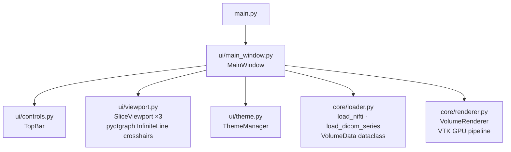

# MPRViewer

**Multi-Planar Reconstruction medical image viewer — NIfTI, DICOM, embedded 3D volume rendering.**

---

MPRViewer loads volumetric MRI and CT data and displays all three orthogonal
planes simultaneously — Axial, Coronal, and Sagittal — with synchronized,
draggable crosshair navigation. A fourth panel embeds VTK GPU ray-cast volume
rendering directly in the window.

---

## At a glance

| Feature | Details |
|---|---|
| **File formats** | NIfTI (`.nii`, `.nii.gz`), DICOM series, single DICOM |
| **MPR planes** | Axial, Coronal, Sagittal — synchronized |
| **Crosshairs** | Draggable — drag any line to update all three planes in real time |
| **Window / Level** | Per-plane W/L controls embedded in each viewport |
| **Colormaps** | Per-plane, embedded per viewport: Gray, Viridis, Plasma, Inferno, Magma, Hot, Bone, Jet |
| **Cine mode** | Per-plane 20 fps animated playback (per viewport) |
| **3D rendering** | VTK GPU ray-cast, embedded as 4th viewport |
| **Transfer functions** | MRI default, Bone, Angio, PET presets |
| **Theme** | Dark (clinical default) + light mode toggle |
| **Background loading** | Large volumes load in a background thread — UI stays responsive |

---

## Architecture



**Hard boundary:** `core/` modules never import PyQt5, pyqtgraph, or matplotlib.
They take a file path, return a `VolumeData` object containing a normalised
float32 array and physical spacing. This means they work independently in
scripts and notebooks.

---

## Quick start

```bash
git clone https://github.com/BasselShaheen06/MPR_Viewer.git
cd MPR_Viewer
python -m venv venv
venv\Scripts\activate       # Windows
source venv/bin/activate    # macOS / Linux
pip install -r requirements.txt
python main.py
```

→ **[Full installation guide](installation.md)**

---

## Project context

Built as part of the Biomedical Signal and Image Processing course (SBME205),
Faculty of Engineering, Cairo University. Semester 2, 2025–2026.