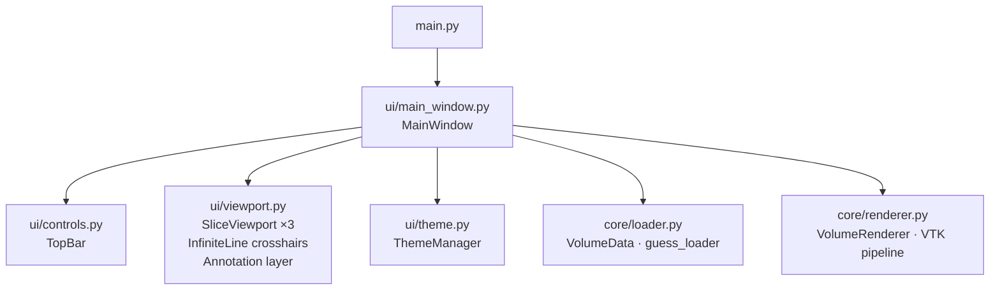

# MLenz

<div class="mlenz-hero">
    <div class="mlenz-hero__bg"></div>
    <div class="mlenz-hero__content">
        <div class="mlenz-hero__kicker">MRI viewer for fast MPR review</div>
        <h1 class="mlenz-hero__title">MLenz</h1>
        <p class="mlenz-hero__sub">
            Multi-Planar Reconstruction for NIfTI and DICOM, with synchronized
            crosshairs, slice cine, and embedded 3D volume rendering.
        </p>
        <div class="mlenz-hero__cta">
            <a class="mlenz-btn mlenz-btn--primary" href="installation/">Get started</a>
            <a class="mlenz-btn" href="usage/">View the guide</a>
            <a class="mlenz-btn mlenz-btn--ghost" href="https://github.com/BasselShaheen06/MLenz">GitHub</a>
        </div>
        <div class="mlenz-hero__badges">
            <span>PyQt5</span>
            <span>VTK GPU</span>
            <span>SimpleITK</span>
            <span>3-plane sync</span>
            <span>Tour overlay</span>
        </div>
    </div>
</div>

---

## Demo

<div class="mlenz-demo">
    <div class="mlenz-demo__placeholder">Demo GIF goes here</div>
    <div class="mlenz-demo__notes">
        Planned flow: load volume → drag crosshair → switch colormap → enable 3D →
        annotate a slice → export PNG.
    </div>
</div>

---

## Screenshots

<div class="mlenz-grid">
    <div class="mlenz-card">Main view (MPR planes)</div>
    <div class="mlenz-card">Per-viewport controls</div>
    <div class="mlenz-card">Annotation mode</div>
    <div class="mlenz-card">3D volume rendering</div>
    <div class="mlenz-card">Light mode</div>
</div>

---

## At a glance

| Feature | Details |
|---|---|
| **File formats** | NIfTI `.nii`/`.nii.gz` · single DICOM `.dcm` |
| **MPR planes** | Axial · Coronal · Sagittal — synchronized |
| **Crosshairs** | Draggable — move any line, all three planes update in real time |
| **Crosshair circle** | Hollow red dot marks the intersection point |
| **Per-viewport controls** | Play/Pause · colormap · W/L sliders — embedded in each viewport |
| **Global cine** | ▶ All / ⏸ All — play every plane together |
| **Annotation** | Freehand drawing, clear, export viewport as PNG |
| **3D rendering** | VTK GPU ray-cast embedded as 4th panel |
| **Transfer functions** | MRI default · Bone · Angio · PET presets |
| **Theme** | Dark (clinical default) + light mode toggle |
| **Background loading** | QThread — UI stays responsive |
| **Slice cache** | LRU + prefetch for fast navigation |
| **Start screen** | fMRI-style gradient splash with dark overlay |
| **Guided tour** | Step-by-step overlay with spotlight prompts |

---

## Architecture



**Hard boundary:** `core/` never imports PyQt5, pyqtgraph, or matplotlib.

---

## Quick start

```bash
git clone https://github.com/BasselShaheen06/MLenz.git
cd MLenz
python -m venv venv
venv\Scripts\activate       # Windows
source venv/bin/activate    # macOS / Linux
pip install -r requirements.txt
python main.py
```