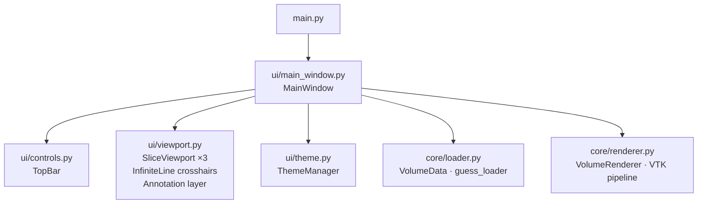

# MPRViewer

**Multi-Planar Reconstruction medical image viewer — NIfTI, DICOM, embedded 3D volume rendering.**

---

## Demo

> 📹 **Demo coming soon**
>
> Record with ScreenToGif: load a NIfTI brain scan → drag crosshair across
> all three planes → switch colormap on one plane → enable 3D viewport →
> draw an annotation → save annotated PNG

<!--  -->

---

## Screenshots

> 📸 **Screenshots coming soon** — take after first successful run

<!-- Uncomment once captured:

### Main view — three synchronized planes


### Annotation mode


### 3D volume rendering


### Light mode


-->

---

## At a glance

| Feature | Details |
|---|---|
| **File formats** | NIfTI `.nii`/`.nii.gz` · DICOM series · single DICOM |
| **MPR planes** | Axial · Coronal · Sagittal — synchronized |
| **Crosshairs** | Draggable — move any line, all three planes update in real time |
| **Crosshair circle** | Hollow red dot marks the intersection point |
| **Per-viewport controls** | Play/Pause · colormap · W/L sliders — embedded in each viewport |
| **Annotation** | Freehand drawing, clear, export viewport as PNG |
| **3D rendering** | VTK GPU ray-cast embedded as 4th panel |
| **Transfer functions** | MRI default · Bone · Angio · PET presets |
| **Theme** | Dark (clinical default) + light mode toggle |
| **Background loading** | QThread — UI stays responsive |
| **Slice cache** | LRU + prefetch for fast navigation |

---

## Architecture



**Hard boundary:** `core/` never imports PyQt5, pyqtgraph, or matplotlib.

---

## Quick start

```bash
git clone https://github.com/BasselShaheen06/MPR_Viewer.git
cd MPR_Viewer
python -m venv venv
venv\Scripts\activate       # Windows
source venv/bin/activate    # macOS / Linux
pip install -r requirements.txt
python main.py
```