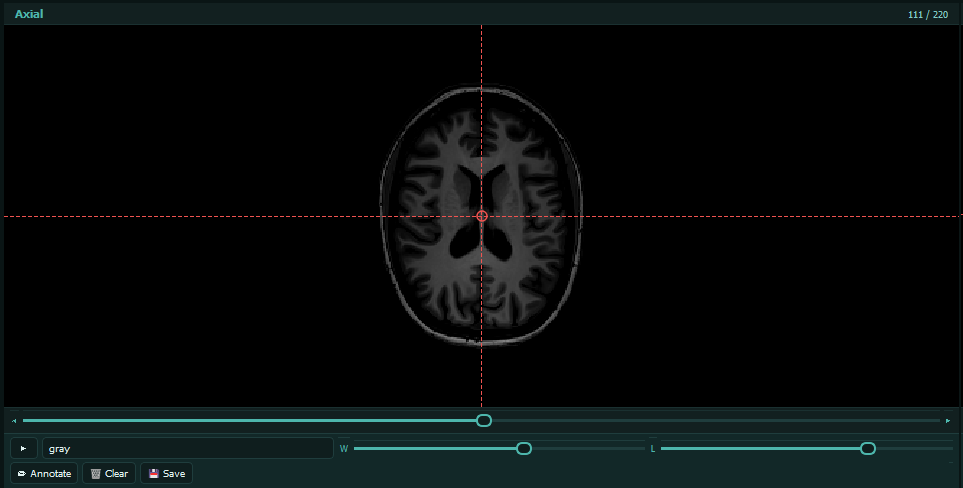
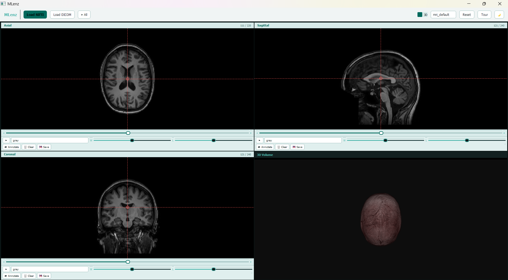
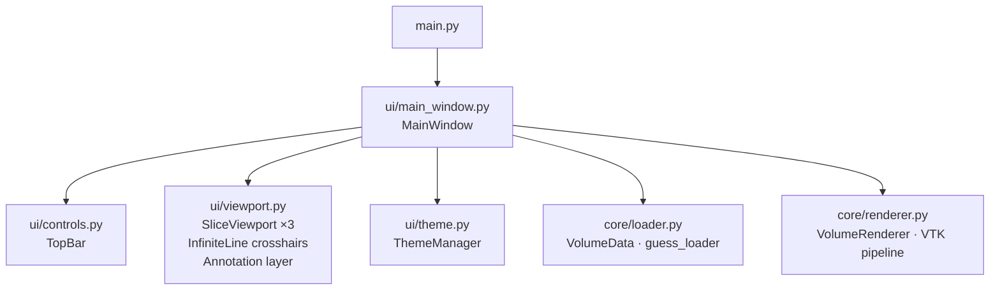

# MLenz

**Multi-Planar Reconstruction MRI viewer — NIfTI, DICOM, embedded 3D volume rendering.**

---

## Demo

### MLenz demo 2.0

<video controls width="100%">
    <source src="assets/demo/MLenzDemo%202.0.mp4" type="video/mp4">
    Your browser does not support the video tag.
</video>

### MLenz demo 1.0

<video controls width="100%">
    <source src="assets/demo/demo%201.0.mp4" type="video/mp4">
    Your browser does not support the video tag.
</video>

---

## Screenshots

### Entry window


### Main view


### 2x2 grid with 3D panel


### Different color mapping


### Window/Level controls


### Draw annotations


### Annotations fade with slices


### 3D construction using VTK


### Light mode


---

## At a glance

| Feature | Details |
|---|---|
| **File formats** | NIfTI `.nii`/`.nii.gz` · single DICOM `.dcm` |
| **MPR planes** | Axial · Coronal · Sagittal — synchronized |
| **Crosshairs** | Draggable — move any line, all three planes update in real time |
| **Crosshair circle** | Hollow red dot marks the intersection point |
| **Per-viewport controls** | Play/Pause · colormap · W/L sliders — embedded in each viewport |
| **Global cine** | ▶ All / ⏸ All — play every plane together |
| **Annotation** | Freehand drawing, clear, export viewport as PNG |
| **3D rendering** | VTK GPU ray-cast embedded as 4th panel |
| **Transfer functions** | MRI default · Bone · Angio · PET presets |
| **Theme** | Dark (clinical default) + light mode toggle |
| **Background loading** | QThread — UI stays responsive |
| **Slice cache** | LRU + prefetch for fast navigation |
| **Start screen** | fMRI-style gradient splash with dark overlay |
| **Guided tour** | Step-by-step overlay with spotlight prompts |

---

## Architecture



**Hard boundary:** `core/` never imports PyQt5, pyqtgraph, or matplotlib.

---

## Quick start

```bash
git clone https://github.com/BasselShaheen06/MLenz.git
cd MLenz
python -m venv venv
venv\Scripts\activate       # Windows
source venv/bin/activate    # macOS / Linux
pip install -r requirements.txt
python main.py
```